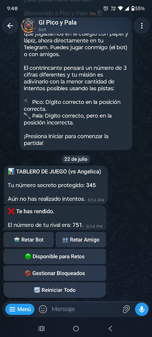
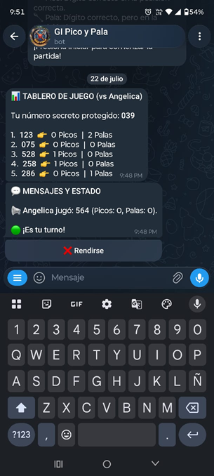

# Nodejs.Telegram.Bot.Juego_Pico_Pala 🎮🐂

**Nodejs.Telegram.Bot.Juego_Pico_Pala** es un bot interactivo de Telegram desarrollado en **Node.js** que implementa el clásico juego de lógica y deducción **Pico y Pala**.

## 🎮 ¡Pruébalo en vivo!
Puedes jugar directamente en Telegram buscando el bot o haciendo clic en el siguiente enlace:
👉 **[@GI_Pico_Pala_Bot](https://t.me/GI_Pico_Pala_Bot)**

## 🚀 Sobre el Proyecto
Este proyecto fue creado para ofrecer una experiencia fluida y completa de juego dentro de Telegram, permitiendo enfrentamientos tanto individuales contra un bot automatizado como duelos multijugador (1v1) en tiempo real con dinámicas de turno y un sistema justo de revanchas.

## 📱 Vista Previa
<p align="center">
  <!-- Puedes agregar capturas de pantalla de tu bot aquí -->
  
  
</p>

## ✨ Características principales
* **Modo Singleplayer:** Juega de forma individual contra la IA del bot.
* **Modo Multijugador (PVP):** Desafía a otros usuarios registrados en tiempo real.
* **Sistema Justo de Revanchas:** El perdedor de la partida anterior recibe la ventaja de iniciar el primer turno en la siguiente ronda.
* **Gestión de Usuarios y Privacidad:** 
  * Función de "No Molestar" (DND).
  * Lista de usuarios bloqueados para evitar retos no deseados.
  * Buscador y filtro de jugadores activos.
* **Persistencia de Sesiones:** Guardado automático del estado de las partidas mediante archivo local para no perder avances.

## 🧠 Reglas del Juego

El objetivo es adivinar un **número secreto de 3 dígitos sin repetir**:

* 🎯 **Pico:** Indicará que uno de los dígitos ingresados está presente **y en la posición exacta**.
  ```text
  Número a adivinar:   123
  Intento de adivinar: 093  --> (1 Pico: el 3 está en su posición)
  Intento de adivinar: 193  --> (2 Picos: el 1 y el 3 están en su posición)
  ```

* 🎯 **Pala:** Indicará que uno de los dígitos ingresados está presente en el número secreto, pero **en una posición incorrecta**.
  ```text
  Número a adivinar:   123
  Intento de adivinar: 390  --> (1 Pala: el 3 existe pero está en otra posición)
  Intento de adivinar: 391  --> (2 Palas: el 1 y el 3 existen pero están en otra posición)
  ```

*Gana el primer jugador que logre 3 Picos (3 dígitos correctos en la posición correcta).*

## 🛠️ Tecnologías utilizadas
* **Lenguaje:** JavaScript (ES6+)
* **Entorno de ejecución:** Node.js (v24.17.0)
* **Framework:** [Telegraf](https://telegraf.js.org/) (Bot API de Telegram ^4.16.3)
* **Librerías clave:**
  * `dotenv` (Gestión de variables de entorno ^17.4.2)
  * `fs` (Persistencia nativa de datos en JSON)

## ⚙️ Configuración e Instalación

Si deseas clonar y ejecutar este bot en tu propio entorno local o servidor:

0. **Requisito previo:** Tener instalado **[Node.js](https://nodejs.org/)** (v20 o superior recomendada).

1. **Clonar el repositorio:**
   ```bash
   git clone https://github.com/gaitanivan/Nodejs.Telegram.Bot.Juego_Pico_Pala.git
   cd Nodejs.Telegram.Bot.Juego_Pico_Pala
   ```

2. **Instalar dependencias:**
   ```bash
   npm install
   ```

3. **Configurar variables de entorno:**
   * Haz una copia del archivo `.env.example` y renómbralo a `.env`.
   * Abre el archivo `.env` y coloca el token de tu bot generado mediante **@BotFather** en Telegram:
     ```env
     PICO_PALA_BOT_TOKEN=tu_token_aqui
     ```

4. **Iniciar el bot:** *(Asegúrate de estar ubicado en la raíz del proyecto)*:
   ```bash
   node index.js
   ```

## ⚖️ Licencia y Atribuciones
Este proyecto se distribuye bajo la licencia **MIT**. 
Para más detalles sobre las dependencias y paquetes de terceros utilizados por Node.js y Telegraf, consulta el archivo `package.json`.

## 🤖 Créditos
Desarrollado con el apoyo de **Google Gemini** como asistente de arquitectura, lógica de negocio y depuración de código.
